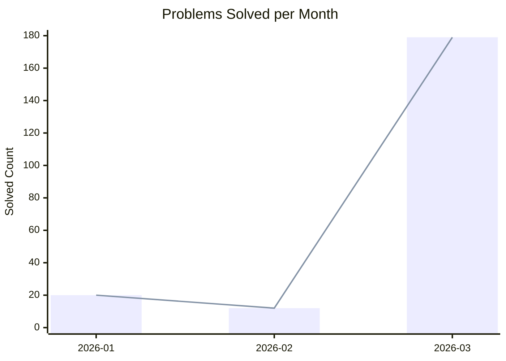

# ⚡ CP Progress Sync Dashboard

> _Auto-updated on 17 Mar 2026_

## 🔥 Progress Activity Overview

## 🌟 Overall Monthly Progress

| Month | Problems Solved |
| :--- | :---: |
| **2026-01** | 20 |
| **2026-02** | 12 |
| **2026-03** | 179 |

## 🎯 Platform Breakdown

### LeetCode
| Month | Problems Solved |
| :--- | :---: |
| **2026-01** | 11 |
| **2026-02** | 7 |
| **2026-03** | 179 |

### Codeforces
| Month | Problems Solved |
| :--- | :---: |
| **2026-01** | 9 |
| **2026-02** | 5 |
